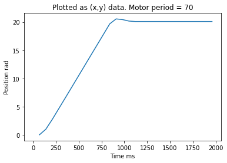
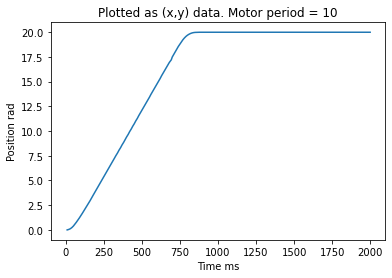
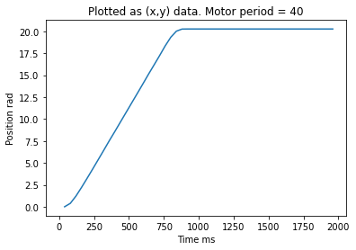

# ME 405 Lab 3

Spinning two motors at once with the magic of scheduling

## Somebody come Git her

This lab required us to tune the period of our motor. We tested values manually.
The Kp is 50 as determinted to be most efficient by lab2. Is used for our motors while determining the motor period.
We tried 70 as our period but it produced a noticable amount of overshoot. We want our period not to produce overshoot so we need a faster period. 
Then we tried 10 and there was no overshoot but we want to find the slowest period that produces no overshoot. 
40 was a good period with no overshoot so we decided to stick with it. See images below.

__Figure 1:__ Motor Responce, Mp = 70.

__Figure 2:__ Motor Responce, Mp = 10.

__Figure 3:__ Motor Responce, Mp = 40.

### Classes

* [Encoder.py](https://github.com/danrmunic/405Lab3/blob/main/src/Encoder.py)
* [motor_driver.py](https://github.com/danrmunic/405Lab3/blob/main/src/motor_driver.py)
* [main.py](https://github.com/danrmunic/405Lab3/blob/main/src/main.py)
* [closedloop.py](https://github.com/danrmunic/405Lab3/blob/main/src/closedloop.py)

### Class run by the PC

* [Lab03_PC](https://github.com/danrmunic/405Lab3/blob/main/src/Lab03_PC.py)

## Documentation

* [Lab03 Documentation](https://github.com/danrmunic/405Lab3)

## Website Link

* [Lab03 Website](https://danrmunic.github.io/405Labs/docs/index.html)
